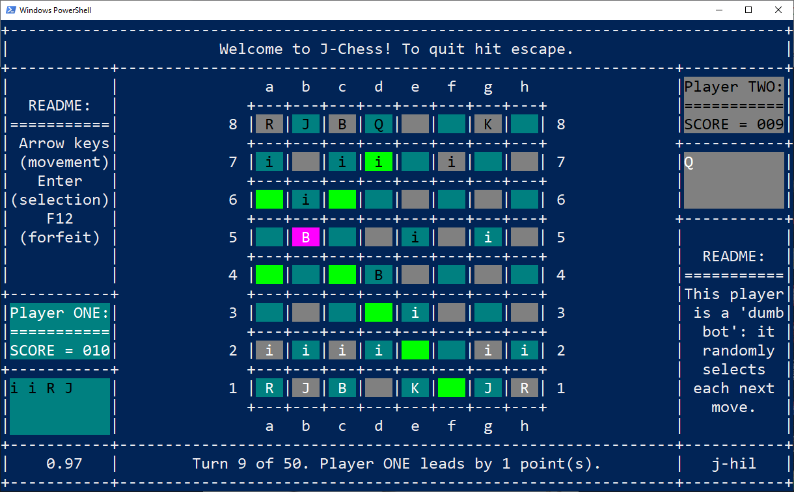

# J-Chess: Play chess in the console!

A project which enables you to play chess from within your console. Just a pet project
and lacking a lot of features (see [`TODO.md`](docs/plan/todo.md)) it is functional
if you want to play a game with a friend locally (or just play yourself?).

To play simply install from the `j-chess` package from PyPI and run the package as a
module, i.e use the following 2 commands
```shell
pip install j-chess
```
```shell
python -m j-chess
```
and you should see something like the following:
<h1 align="center">

</h1><br>

Enjoy!
